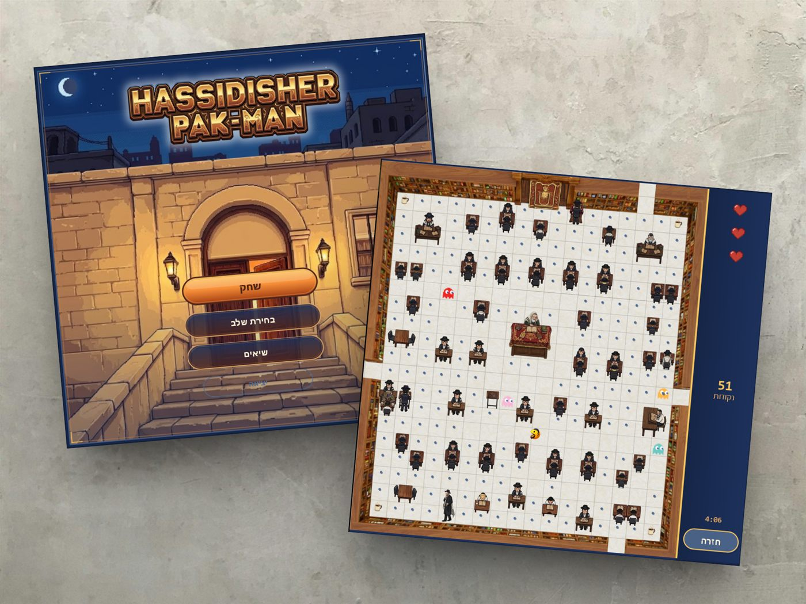

# Hassidisher Pakman

משחק מבוך בסגנון Pac-Man, בעברית, עם אווירת ישיבה — בנוי ב־**Java Swing**.

אסוף נקודות, הימנע מרוחות, אסוף פרסים בכל סדר, והשאיר את שמך בטבלת השיאים.

<p align="center">
  
</p>

## מה יש במשחק

- **4 סדרים** — שחרית · סדר עיונא · סדר גירסא · סדר ערב
- **פרס בכל שלב** — תפילין, ספרים, כובע (נקודות בונוס)
- **תפריט בעברית** עם רקע מותאם ועיצוב זהב/כחול
- **טבלת שיאים** שמורה מקומית
- חלון קבוע, תנועה על רשת אריחים, רקעי מבוך מותאמים לכל שלב

## איך מריצים

**דרישה:** JDK 17 ומעלה

```bash
# קומפילציה
javac -encoding UTF-8 -d bin src/com/hasidicmaze/*.java src/com/hasidicmaze/*/*.java

# הרצה (מתוך תיקיית הפרויקט)
java -cp bin com.hasidicmaze.App
```

או פשוט לחץ כפול על `run.bat` / `run.vbs`.

### מקשים

| מקש | פעולה |
|-----|--------|
| חיצים | תנועה |
| ESC | חזרה לתפריט |
| Enter | אישור (סוף משחק / שיא חדש) |

## מבנה הפרויקט (בקצרה)

```
src/com/hasidicmaze/   קוד המשחק (UI, מבוך, AI, ניקוד)
assets/                תמונות רקע, דמויות, UI
data/scores.txt        שיאים שמורים
docs/screenshots/      צילומי מסך ל־README
```

## קרדיטים

בסיס הלמידה המקורי: [ImKennyYip / pacman-java](https://github.com/ImKennyYip/pacman-java)

האמנות, התפריטים בעברית, השלבים והעיצוב — מקוריים ל־**Hassidisher Pakman**.

—

**menmen770** · [github.com/Menmen770/hassidisher-pakman](https://github.com/Menmen770/hassidisher-pakman)
